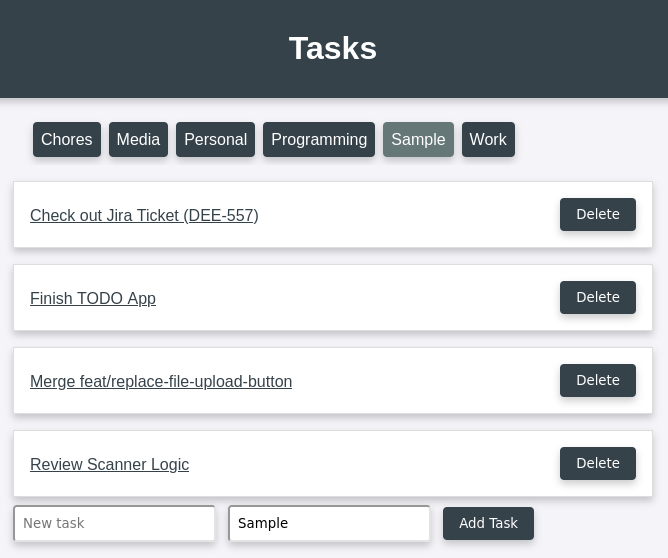

## Overview

<p align="center">
  
</p>

This Lua-based web application is designed for managing a simple todo list using
the Turbo.lua framework. The application provides basic CRUD (Create, Read,
Update, Delete) operations on task entries stored in a local text file.

## Features

- Create new tasks with a specified category. Tasks are stored persistently in a text file.
- Display tasks filtered by category. Supports navigation through task categories.
- Modify existing tasks, including the task description and category.
- Delete tasks from the list with a confirmation prompt.
- Automatically sorts tasks into categories; categories are displayed as a list of tags for easy navigation.
- Tasks are serialized and saved to a text file (`todos.txt`) for persistent storage.
- HTML forms and lists are dynamically generated and served, with a simple, lightweight design.
- Uses plain HTML and CSS for the frontend, offering a clean and straightforward user experience.
- Safe transmission and reception of data through HTTP requests.
- Handles multiple endpoints for distinct operations using the Turbo.lua framework.
- Custom error handler for undefined routes.

## Setup

Install dependencies listed below, and then run the following command to install
the Turbo library:

```
luarocks install turbo
```

## Usage

Start the server with:

```
luajit main.lua
```

then open your browser to localhost:8888

## Dependencies

```
luajit
luarocks
git
build-essential
libssl-dev
```

## Implementation Details

The individual TODO items are saved in a plain text file called todos.txt.

## License

This work is licensed under the GNU General Public License version 3 (GPLv3).

[](https://www.gnu.org/licenses/gpl-3.0.en.html)
